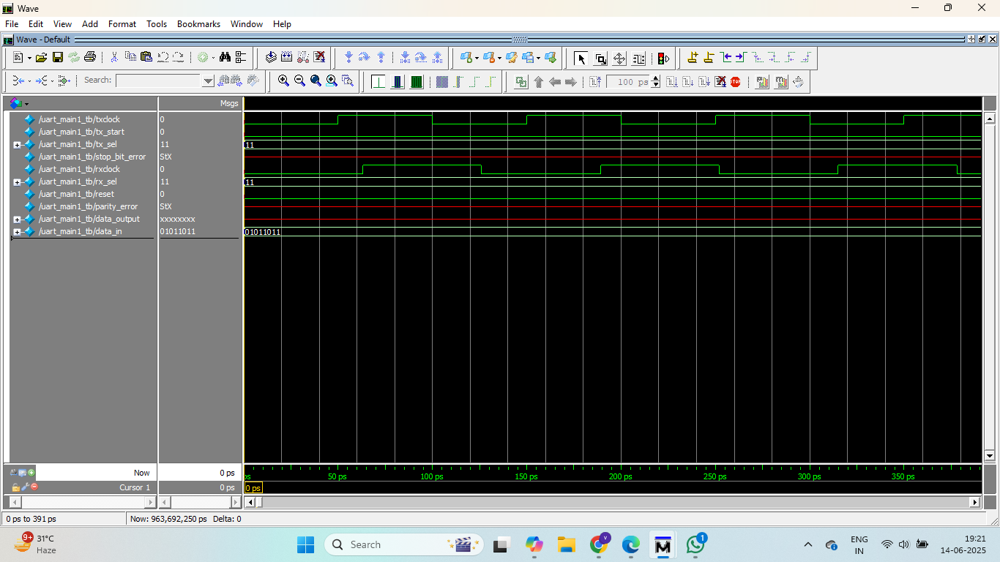

# UART Design in Verilog

## 📌 Description
A Universal Asynchronous Receiver-Transmitter (UART) module implemented in Verilog to enable serial communication between hardware components.

## ⚙️ Features
- Baud rate generation
- 8-bit data framing with start/stop bits
- Parity and error detection
- Functional verification using testbenches

## 🧪 Tools Used
- Verilog HDL
- ModelSim / QuestaSim

## 🧠 Learnings
- Digital design fundamentals
- Synchronous logic design
- Functional verification under edge cases

## 📸 Simulation Output


## 📂 Project Structure
```
uart-verilog-design/
├── UART.v
├── UART_result.png
├── README.md
```

## 🧑‍💻 Author
**Vishnu Vardhan**